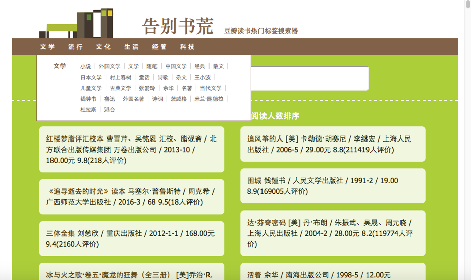

#豆瓣读书排行

###1.使用Pyspider获取最新数据或直接使用已有文件（book_data)
1.命令行输入pyspider all;
2.Browser打开localhost:5000;
3.新建项目，粘贴爬虫代码(booksSpider.py);
4.选择debug项或running项，点击run开始;
5.观察命令行，等待数据获取。

###2.命令行进入book_data目录，运行索引器(search.py),在search目录生成索引
	* OS X下:
	* $ cd doubanSpider
	* $ python search.py

###3.打开index.html即可使用。

